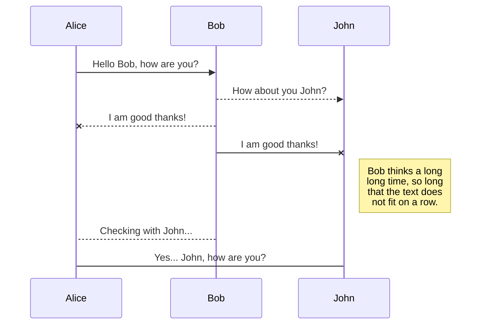
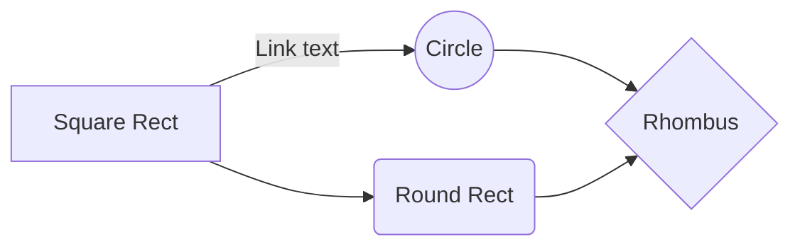

# C3PacBio
# A Comprehensive and Reproducible Nextflow Pipeline for Bacterial Genome Analysis using PacBio Unaligned BAM Files

Welcome!  Are you new to PacBio and struggle to manage massive data files?  Do you want more opportunities to personalize your workflow with program settings that interest you?  Do you love automated figure generation but still want to pick the colors and tailor the output to your target journal?  

In walks C3PacBio, a Nextflow pipeline developed to make massive files easier to manage and provide common analyses for Microbial Genomics in an ecosystem that hates big files.  

Of note, the views expressed on this GitHub are personal and do not reflect any other viewpoints.  This is not an endorsed pipeline and it does not speak for any entity, person, or organization.  

So, let's get to it!

# Key Features

 - Automated Setup: A single setup.sh script installs all dependencies and downloads    
   required databases. 
 - User-Friendly: Interactive prompts for key parameters like genome size and coverage.
 - High-Performance: Optimized for parallel execution on multi-core workstations.
 - Comprehensive Annotation: Integrates a suite of best-in-class tools for a deep  
    biological understanding of the assembly. 
 - Comparative Genomics: Includes a full SNP-calling workflow for phylogenetic and 
    genomic analysis.
 - Reproducibility: All software dependencies are explicitly managed by Nextflow and    
   Conda, guaranteeing a consistent environment.

# Downloading and Installing C3PacBio with Dependencies

The program titled shell.sh in the list of files at the top of this page does the following tasks: 

 1. Installs Nextflow
 2. Installs and Updates Javascript
 3. Installs Conda
 4. Installs R
 5. Installs R Studio
 6. Installs GitHub Dependencies
 7. Fetches the Git Files so you don't have to and sets them up
 8. Installs the databases and unpacks them
 9. Makes everything executable (aka you can run the program).

From start to finish, on a naive (or uninstalled) system, it takes about 3 hours if there is a good internet connection.   

So how do you use this file?  First, you need to make sure your system has some very basic requirements satisfied prior to installing C3PacBio.  These requirements are as follows:

 1. You are using an Apple Desktop or a Linux Workstation OR a cloud using a Linux operating system.  This program will not work on Windows as the computing languages used to run this program are not the same.  
 2. You have enough memory to run this program.  Most standard computing systems (Apple Desktop, Linux Workstations) have this covered as of February 2026.  But, if you use the computer for other tasks, you'll want to make sure there is enough harddrive present to analyze the massive files.  If you are using the SRA download option, the burdeon isn't as massive.  But, if you are using HiFi BAM files, you are looking at between 50 and 100 GB per file.  Your output will not come close to that (about 5 GB per file) but if you expect it to run, you need to have hard drive (at least 500 GB if you have 3 files to run (HiFi BAM)), 16 to 32 GB of memory, and 500 GB of RAM.  
 3. The setup.sh scans your system and ensures you have the necessary programs to give you complete control of your system.  Conda was chosen as it is a lot easier to manage for people new to this kind of analysis and in ecosystems where data security is scrutinized, is easier.  The file that downloads works with Linux, it does not work with Apple.  That file download will need to change.
 4. Once your setup.sh is executed, Nextflow will operate in the folder where the file is initiated.  If you don't like that, set your path. 

So, how does this work?  What do I do? 

Follow these steps precisely: 

 1. Download shell.sh or copy and paste it and save it in a text file as "shell.sh" **in the working directory you intend to work**.  If you save it as shell.txt, you will have problems. If you mess around with your working directories, you'll be unhappy. 
 2. Make the shell program executable with the following command:
    ```chmod -x shell.sh```
 3. Execute the command. 
     ```bash shell.sh ```

**IMPORTANT:** The install system is fully automated and assumes that you accept the terms and conditions of every program that is downloading.  If you do not accept the terms and conditions, you cannot use the programs.  That is a you problem, not a me problem.  So, make your choices as you make them, ensure you're following company policies with data security, and relax.  You will see a lot of stuff tick across the screen as the shell program executes.  This is normal.  So, go get some coffee, have a couple of meetings, and come back in 2 to 4 hours and be ready to work.  If an error shows up, please let me know in the QA section of this GitHub page and I'll figure something out. 


## Make Sure Your Files Are Ordered Properly

Remember, I told you to install the program (shell.sh) in your working directory or the file folder you intend to generate your data.  This is the order that your working directory should be in prior to adding your inputs folder.  This is ordered like an onion and I am assuming we are working in our Desktop directory, though you can pick Documents or whatever makes you happy.  

Desktop
-Project
--main.nf
--nextflow.config
--envs (this is where your conda environments will be housed)
--modules (this is where your modules are located that you can adjust if need be)

You will want to navigate to that directory and execute exactly this code (again assuming it is on the desktop)
```
   cd ./Desktop/Project
   mkdir inputs
  ```
  
  Now, take your unaligned bam files and drop them into the inputs folder.  Do not change the names of the folders.  I know inputs seems silly but here we are. 

Now, you have other options besides your files from your sequencing run, mainly harvesting data from public repositories.  The example for the publication uses SRA from NCBI, but others exist.  First, if you want to mass download SRA files that result from PacBio Sequencing, please navigate to the directory at the top of the page titled "Code for Paper" and find the file labeled "GettingData" and follow the directions to get that done.   It is well annotated. 

## Prepping for your run

You need to get the link to download the GFF3 file and the FNA file for the reference data you will be using.  This is a *de novo* alignment.  However, for SNP analyses, you require a reference file.  You will also need to know the following information:

 1. How big is your intended genome
 2. What do you like for sequencing depth
 3. How powerful is your computer system

More is not better in the world of sequencing depth when it comes to bacterial genomics.  At a certain point, and with PacBio that can vary, increased depth decreases assembly quality and the likelihood of recovering plasmids.  The default is 100x and we subsample with Rasusa.  This gives a pretty high quality assembly and is documented to do just that (plus plasmids need our love too!).    So, do what makes you happy, but having 700x or 900x depth is not ideal in this instance.   Also, go through the programs.  If you'd like to increase some of the program commands, do so.  But, first train yourself using the data from the publication so you know the program runs.  If you change everything around before validating that the program runs, life is harder to troubleshoot. 

For your computer system, run the following command:
```
lscpu  ## This tells you how many CPUs and cores you have onboard ##
free -h ## This tells you your available memory, used, and total ##
```
Now, this is important.  Your number one failure point will be memory.  In your nextflow.config file, you have code that looks like this:

```

executor {
    name = 'local'
    cpus = 36
    memory = '256GB'
}

singularity {
    enabled = false
    autoMounts = true
}

process {
    cpus = 4
    memory = '8GB'
    time = '6h'

    withLabel: 'process_low' {
        cpus = 2
        memory = '4GB'
        time = '1h'
    }
    withLabel: 'process_medium' {
        cpus = 8
        memory = '32GB'
        time = '8h'
    }
    withLabel: 'process_high' {
        cpus = 12
        memory = '120GB'
        time = '48h'
    }
}
```
This file is optimized to run 3 large files with 12 CPUS each and consume 80 GB of memory on the high process.   You can always increase the memory and you can play with the CPUs to make it work better. 

You will also need to deposit your reference sequence in the nextflow.config file.  


## Let's get the party started!

Without further adieu, it is time to run the data party.  This command will execute the nextflow and let you know how your run went:

```
$nextflow run main.nf --input_bam 'inputs/*.bam' --genome_size '4.2m' --coverage 100 -with-report report.html -with-timeline timeline.html -with-trace trace.txt --resume
```

You will see this...
```
 N E X T F L O W   ~  version 25.10.4

Launching `main.nf` [shrivelled_williams] DSL2 - revision: eae8d1587e

executor >  local (6)
[89/4d79ed] DOWNLOAD_HUMAN_GENOME          | 1 of 1 \u2714
[a8/63d72f] DOWNLOAD_BACTERIAL_REFERENCE   | 1 of 1 \u2714
[1e/ea6e0a] INDEX_BACTERIAL_GENOME         | 1 of 1 \u2714
[df/e7229f] BAM\u2026AM to FASTQ for SR3324231) | 1 of 1 \u2714
[76/d4e5ef] MIN\u2026g SR3324231 with minimap2) | 1 of 1 \u2714
[5b/99e0b4] SUB\u2026ing SR3324231 with Rasusa) | 0 of 1
[-        ] CLEAN_QAQC                     -
[-        ] FLYE_ASSEMBLY                  -
[-        ] QUAST_REPORT                   -
[-        ] BAKTA_ANNOTATION               -
[-        ] AMRFINDER_ANALYSIS             -
[-        ] PLASMIDFINDER_ANALYSIS         -
[-        ] MOB_SUITE_ANALYSIS             -
[-        ] RUN_ABRICATE                   -
[-        ] CRISPR_TYPING                  -
[-        ] BOSCO                          -
[-        ] ALIGN_TO_REFERENCE             -
[-        ] CALL_VARIANTS_BCFTOOLS         -
[-        ] FILTER_VARIANTS_BCFTOOLS       -
[-        ] SUMMARIZE_RESULTS              -
[-        ] MULTIQC                        -
[-        ] GENERATE_FINAL_REPORT          -
```
As the process runs, the 0% will become 100%.  You should see a working directory (work) and a results folder generate, as well as a summarize folder and a folder PER sequence you're analyzing.  At any time, you can run the following command to make sure the programs are running in a new terminal window
```
htop
```
If you see python or conda or the actual programs execute, you know the system is working.  If you see a lot of 0's, not a lot is happening.  You should kill the process and restart it. 

## Pipeline Steps & Tools Used
This pipeline is composed of several key bioinformatics stages using software created by very talented and amazing human beings. The following tools are used and should be cited in any resulting publications.  

 1. Decontamination: Remove host (human) DNA contamination from the raw 
     reads
	     **Tools:**
	     **Samtools:** Converts BAM to FASTQ format for processing
         **Minimap2:** Aligns all reads against the human genome for filtering out    
         contamination
   2. Read Subsampling to reduce the sequencing depth to an optimal level for  
         efficient assembly.
         Tool:
         Rasusa: A fast and memory-efficient tool for random subsampling of FASTQ files.
Assembly & Quality Control Goal: Perform de novo assembly and assess its quality.
Tools:

Flye: A high-quality de novo assembler specifically designed for long and noisy reads.

QUAST: Generates comprehensive quality metrics for the assembly (e.g., N50, L50, number of contigs).

Functional Annotation Goal: Identify genes, mobile genetic elements, and other features in the final assembly.
Tools:

Bakta: Provides comprehensive, rapid, and standardized annotation of the bacterial genome.

AMRFinderPlus: Identifies acquired antimicrobial resistance (AMR) genes using NCBI's curated database.

PlasmidFinder: Detects plasmid replicons to identify known plasmid types from assembled sequences.

MOB-suite: Characterizes plasmid mobility and reconstructs plasmid sequences from assemblies.

ABRicate: Screens contigs against multiple databases of AMR and virulence genes.

CCTyper: Identifies and types CRISPR-Cas systems within the assembly.

SNP Analysis Goal: Compare each isolate to a reference genome to identify single nucleotide polymorphisms (SNPs) for phylogenetic analysis.
Tools:

Minimap2 and Samtools are used for alignment and processing.

BCFtools: Performs variant calling (identifying SNPs and indels) and filtering.

Reporting Goal: Aggregate results from all tools into a single summary report.
Tool:

MultiQC: Creates a single, interactive HTML report from the logs and outputs from tools like FastQC and QUAST.

What The Citations Mean In the text you pasted, it looks like the tool name and its citation are jumbled together. The original template was structured like this for each tool:

A line with the Tool Name and a link to its source code.

A "blockquote" (>) line containing the proper academic citation for that tool, including the authors, year, title, journal, and the DOI link.

For example:

Flye (GitHub): A high-quality de novo assembler...

Kolmogorov, M., et al. (2019). Assembly of long, error-prone reads... Nature biotechnology... DOI: 10.1038/s41587-019-0072-8

[Your future publication details will go here!]

To ensure reproducibility, please also cite Nextflow and the individual software tools listed above.


-


## UML diagrams

You can render UML diagrams using [Mermaid](https://mermaidjs.github.io/). For example, this will produce a sequence diagram:



And this will produce a flow chart:


